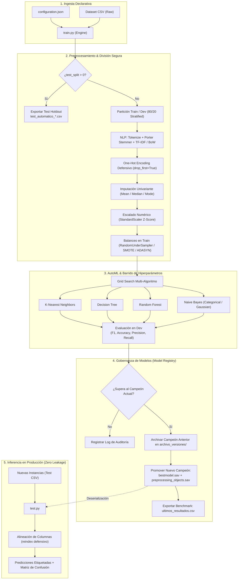

# AutoML Classification Engine & Model Governance Pipeline

[](https://www.python.org/)
[](https://scikit-learn.org/)
[](https://pandas.pydata.org/)
[](https://www.nltk.org/)
[](https://imbalanced-learn.org/)
[](#-arquitectura-del-sistema)
[](#-puntos-fuertes-de-ingeniería-engineering-highlights)
[](LICENSE)

> **Framework modular de Machine Learning para experimentación automatizada (AutoML), ingeniería de características multimodal (datos tabulares y NLP), optimización sistemática de hiperparámetros y ciclo de vida de modelos con gobernanza Champion-Challenger y garantía estricta de cero fuga de datos (*zero data leakage*).**

---

## 📌 Tabla de Contenidos

- [Visión General](#-visión-general)
- [Puntos Fuertes de Ingeniería (Engineering Highlights)](#-puntos-fuertes-de-ingeniería-engineering-highlights)
- [Arquitectura del Sistema](#-arquitectura-del-sistema)
- [Estructura del Proyecto](#-estructura-del-proyecto)
- [Matriz de Algoritmos y Preprocesamiento](#-matriz-de-algoritmos-y-preprocesamiento)
- [Especificación de `configuration.json`](#-especificación-de-configurationjson)
- [Instalación y Requisitos](#-instalación-y-requisitos)
- [Guía de Uso Rápida (CLI)](#-guía-de-uso-rápida-cli)
- [Métricas y Trazabilidad de Salidas](#-métricas-y-trazabilidad-de-salidas)
- [Madurez Técnica y Extensiones a Producción](#-madurez-técnica-y-extensiones-a-producción)
- [Autores](#-autores)
- [Licencia y Reconocimientos](#-licencia-y-reconocimientos)

---

## 🚀 Visión General

Este proyecto implementa un motor desacoplado y reproducible de **AutoML (Automated Machine Learning)** y **Gobernanza de Modelos**. Diseñado para superar las limitaciones de los scripts monolíticos de análisis de datos, el sistema automatiza el flujo completo desde la ingesta de datos brutos hasta la inferencia en producción:

1. **Configuración declarativa (*12-Factor ML*)**: Todo el comportamiento del pipeline (estrategias de partición, preprocesado, balanceo y rejillas de hiperparámetros) se define en un archivo centralizado `configuration.json`, desacoplando la lógica de negocio de la experimentación.
2. **Garantía estricta contra la fuga de datos (*Zero Data Leakage*)**: Todos los transformadores (imputadores, escaladores, codificadores y vectorizadores) se ajustan (`.fit()`) exclusivamente sobre el subconjunto de entrenamiento y se serializan como artefactos para su aplicación determinista (`.transform()`) en validación e inferencia.
3. **Estrategia Champion-Challenger automatizada**: El motor compara automáticamente cada iteración frente al modelo en producción. Si el nuevo candidato supera la métrica objetivo (F1-Score), el campeón anterior es archivado con metadatos y sello de tiempo, y el nuevo modelo es promovido sin intervención manual.
4. **Inferencia defensiva en producción**: El pipeline de test tolera discrepancias comunes del mundo real (categorías no vistas, columnas ausentes, reordenamiento de características) mediante alineación automática de esquemas con `.reindex()`.

---

## 💡 Puntos Fuertes de Ingeniería (Engineering Highlights)

Para un reclutador o líder técnico, este repositorio demuestra habilidades clave en desarrollo de software aplicado a Machine Learning (MLOps):

| Pilar de Ingeniería | Implementación en este Repositorio | Impacto / Valor |
| :--- | :--- | :--- |
| **Prevención de Data Leakage** | Transformadores ajustados (`.fit`) únicamente en entrenamiento y aplicados (`.transform`) sobre validación e inferencia. El remuestreo de clases solo se realiza en el conjunto de entrenamiento. | Previene estimaciones optimistas irreales; garantiza generalización real en producción. |
| **Ingeniería Multimodal (Tabular + NLP)** | Procesamiento conjunto de variables numéricas, categóricas y columnas de texto libre (tokenización, filtrado de stopwords, Porter Stemmer, TF-IDF y BoW con NLTK). | Permite enriquecer datasets tabulares tradicionales con notas libres o descripciones no estructuradas. |
| **Gobernanza (Model Registry Local)** | Almacén de modelos con selección *Champion/Challenger*: si un nuevo modelo supera el F1-Score del campeón actual, el anterior se archiva en `archivo_versiones/` con timestamp y métricas. | Trazabilidad completa y capacidad inmediata de rollback ante degradación del rendimiento. |
| **Inferencia Robusta y Resiliente** | Empaquetado binario (`.sav`) de dependencias de preproceso junto con el modelo clasificador, tolerando columnas faltantes y categorías no vistas en tiempo de predicción. | Evita caídas (*crashes*) por desajuste de columnas dummy (`KeyError` / `DimensionMismatch`). |
| **Reproducibilidad y Trazabilidad** | Semillas pseudoaleatorias fijadas (`random_state=42`) en particiones, remuestreo y algoritmos; volcado exhaustivo de cada iteración a `ultimos_resultados.csv`. | Auditoría completa de experimentos y reproducibilidad matemática garantizada. |

---

## 📐 Arquitectura del Sistema



---

## 📂 Estructura del Proyecto

El repositorio está estructurado para desacoplar el código ejecutable de las configuraciones y los artefactos generados:

```text
├── configuration.json           # Especificación declarativa del pipeline y rejillas
├── requirements.txt             # Dependencias del entorno de ejecución
├── train.py                     # Motor principal de AutoML, preprocesado y versionado
├── test.py                      # Pipeline de inferencia desacoplada y evaluación
├── LICENSE                      # Licencia de código abierto MIT
├── .gitignore                   # Exclusión de datos confidenciales y binarios pesados
└── proyectos/
    └── {project_name}/          # Directorio generado dinámicamente por proyecto
        ├── datos/               # Almacén de datasets y particiones generadas
        │   ├── entrenamiento_*.csv
        │   └── test_automatico_*.csv
        ├── best_model/          # Modelo en producción (Campeón actual)
        │   ├── bestmodel.sav             # Estimador ganador serializado (pickle)
        │   ├── preprocessing_objects.sav # Transformadores ajustados y metadatos
        │   ├── ultimos_resultados.csv    # Benchmark completo de la última ejecución
        │   └── predicciones_generadas/   # Salidas de inferencia con etiquetas
        │       └── pred_{Algoritmo}_F1_{Score}_*.csv
        └── archivo_versiones/   # Histórico inmutable de versiones superadas
            └── v_F1_{Score}_{Timestamp}/
                ├── bestmodel.sav
                └── preprocessing_objects.sav
```

---

## 📊 Matriz de Algoritmos y Preprocesamiento

### Algoritmos Soportados
| Algoritmo | Hiperparámetros Optimizados | Características & Casos de Uso |
| :--- | :--- | :--- |
| **K-Nearest Neighbors (`knn`)** | $k$ (número de vecinos), $p$ (distancia Minkowski: Manhattan / Euclídea), ponderación (`uniform`, `distance`). | Óptimo para espacios de características continuos y fronteras no paramétricas. |
| **Decision Trees (`tree`)** | `max_depth`, `min_samples_leaf`. | Alta interpretabilidad mediante árboles de decisión canónicos y reglas de negocio. |
| **Random Forest (`rf`)** | `n_estimators`, `max_depth`. | Ensamble robusto que minimiza la varianza y reduce drásticamente el riesgo de *overfitting*. |
| **Naive Bayes (`nb`)** | `alpha` (Laplace Smoothing), `n_bins` (`KBinsDiscretizer`), variantes CategoricalNB y GaussianNB. | Inferencia ultra-rápida basada en independencia condicional, eficiente en texto y variables discretizadas. |

### Técnicas de Preprocesamiento Integradas
- **Tratamiento de Valores Faltantes**: Imputación univariante configurable (`mean`, `median`, `most_frequent`).
- **Escalado Numérico**: Estandarización $Z$-Score (`StandardScaler`) indispensable para algoritmos métricos basados en distancias (KNN).
- **Tratamiento de Clases Desbalanceadas**:
  - `undersampling`: Submuestreo aleatorio de la clase mayoritaria (`RandomUnderSampler`).
  - `smote`: Generación de muestras sintéticas en la clase minoritaria por interpolación de k-vecinos (`SMOTE`).
  - `adasyn`: Generación adaptativa concentrada en regiones de alta dificultad fronteriza (`ADASYN`).
- **Procesamiento de Lenguaje Natural (NLP)**:
  - Limpieza léxica: normalización a minúsculas, filtrado de signos de puntuación y *stopwords* configurables por idioma.
  - Normalización morfológica: Stemming mediante el algoritmo de Porter.
  - Representación vectorial: Frecuencia de términos / Inversa de frecuencia de documento (`TF-IDF`) o Bolsa de Palabras (`CountVectorizer`).

---

## ⚙️ Especificación de `configuration.json`

El comportamiento íntegro del pipeline se parametriza mediante un archivo JSON sin modificar una sola línea de código Python:

```json
{
  "project_name": "CreditRisk_Assessment",
  "algorithm": "todos",
  "average_strategy": "macro",
  "preprocessing": {
    "test_split": 0.2,
    "target_variable": "RiskClass",
    "drop_features": ["CustomerID", "Timestamp"],
    "missing_values": "impute",
    "impute_strategy": "median",
    "scaling": "standard",
    "sampling": "smote",
    "text_processing": {
      "enabled": true,
      "columns": ["ReviewNotes"],
      "method": "tf-idf",
      "language": "spanish"
    }
  },
  "hyperparameters": {
    "knn": {
      "k_min": 1,
      "k_max": 9,
      "p_min": 1,
      "p_max": 2,
      "weights": ["uniform", "distance"]
    },
    "trees": {
      "max_depth": [5, 10, 15],
      "min_samples_leaf": [2, 5]
    },
    "random_forest": {
      "n_estimators": [50, 100, 200],
      "max_depth": [5, 10, null]
    },
    "naive_bayes": {
      "n_bins": [5, 10],
      "alphas": [0.5, 1.0],
      "min_categories": null
    }
  }
}
```

### Detalle de Parámetros Clave
- **`project_name`**: Define el identificador del proyecto bajo el cual se aislarán datasets, modelos y predicciones en `proyectos/`.
- **`algorithm`**: Permite enfocar el entrenamiento en un clasificador individual (`"knn"`, `"tree"`, `"rf"`, `"nb"`) o ejecutar el benchmark competitivo completo (`"todos"`).
- **`average_strategy`**: Control del cálculo de métricas multiclase (`"macro"`, `"micro"`, `"weighted"`, `"binary"`, `"auto"`).
- **`test_split`**: Proporción reservada para crear automáticamente un conjunto de prueba independiente y estratificado (valor `0` si se dispone de fichero externo).
- **`drop_features`**: Lista de columnas a descartar antes de modelar (identificadores únicos, marcas temporales, ruido).
- **`text_processing`**: Configuración del pipeline de NLP multimodal integrado.

---

## 🛠️ Instalación y Requisitos

### Prerrequisitos
- **Python**: Versión 3.10 o superior (validado en Python 3.10, 3.11 y 3.12).
- Gestor de paquetes `pip`.

### Configuración del Entorno Virtual

```bash
# 1. Clonar el repositorio
git clone https://github.com/aimarlarriba/SAD-Clasificacion-Automatizada.git
cd SAD-Clasificacion-Automatizada

# 2. Crear el entorno virtual
python -m venv venv

# 3. Activar el entorno virtual
# En Windows (PowerShell / CMD):
venv\Scripts\activate
# En Linux / macOS:
source venv/bin/activate

# 4. Instalar dependencias
pip install -r requirements.txt
```

---

## 💻 Guía de Uso Rápida (CLI)

El flujo de trabajo se divide en dos fases independientes y totalmente desacopladas:

### 1. Fase de Entrenamiento y AutoML (`train.py`)
Ejecuta la ingesta, limpieza, división estratificada, ingeniería de características, barrido de hiperparámetros y registro del modelo ganador:

```bash
python train.py ruta/a/dataset_entrenamiento.csv configuration.json
```

**Comportamiento del Pipeline**:
- Si el archivo CSV ya reside en `proyectos/{project_name}/datos/`, se puede indicar únicamente el nombre del archivo.
- Si el mejor modelo obtenido supera el F1-Score del campeón actualmente en `best_model/`, el sistema realiza automáticamente el archivado del modelo anterior en `archivo_versiones/` y publica el nuevo campeón en `best_model/`.
- Exporta la tabla comparativa exhaustiva `ultimos_resultados.csv`.

### 2. Fase de Inferencia y Evaluación en Producción (`test.py`)
Aplica los transformadores aprendidos sobre nuevas muestras para generar predicciones fiables:

```bash
python test.py ruta/a/dataset_test.csv NombreDelProyecto
```

**Comportamiento de la Inferencia**:
- Carga de forma segura los transformadores serializados en `preprocessing_objects.sav` (imputador, escalador, vectorizador, label encoder).
- Si el archivo de test contiene la variable objetivo, calcula métricas en tiempo de ejecución (Accuracy, Precision, Recall, F1) y muestra la matriz de confusión.
- Si no incluye la variable objetivo (inferencia ciega en producción), genera las predicciones asignando las etiquetas de negocio legibles (`Prediccion_Label`).
- Exporta el dataset enriquecido a `proyectos/{project_name}/best_model/predicciones_generadas/`.

---

## 📈 Métricas y Trazabilidad de Salidas

### Ejemplo de Salida en Consola (`test.py`)
```text
==================================================
PROYECTO: CreditRisk_Assessment | Algoritmo: Random Forest
Combinación: Random Forest (n=100,d=10)
==================================================
F-Score (Val): 0.9421
Accuracy:      0.9450
Precisión:     0.9410
Recall:        0.9433

Matriz de Confusión:
          Aprobado  Riesgo
Aprobado        85       5
Riesgo           6      94

[*] Predicciones guardadas exitosamente en:
    proyectos/CreditRisk_Assessment/best_model/predicciones_generadas/pred_Random_Forest_F1_0.9421_dataset_test.csv
```

### Formato de Registro de Experimentos (`ultimos_resultados.csv`)
Cada ejecución genera una tabla comparativa auditable:

| Combinación | Accuracy | Precisión | Recall | F_score_macro |
| :--- | :--- | :--- | :--- | :--- |
| `Random Forest (n=100,d=10)` | 0.9450 | 0.9410 | 0.9433 | **0.9421** |
| `Tree (d=10,ml=2)` | 0.9120 | 0.9080 | 0.9100 | 0.9090 |
| `KNN (k=5,p=2,w=distance)` | 0.8950 | 0.8910 | 0.8940 | 0.8925 |
| `CategoricalNB (bins=5,alpha=1.0)` | 0.8420 | 0.8390 | 0.8410 | 0.8400 |

---

## 🏗️ Madurez Técnica y Extensiones a Producción

Este framework ha sido concebido como un núcleo extensible para sistemas MLOps en entornos corporativos:

- **Despliegue como Microservicio**: Los artefactos `bestmodel.sav` y `preprocessing_objects.sav` son desacoplados y listos para ser empaquetados en un endpoint REST con **FastAPI** o **Flask**.
- **Contenerización**: Compatible con empaquetado en contenedores ligeros **Docker** (imagen base `python:3.11-slim`), asegurando consistencia entre entornos locales, de staging y producción.
- **Integración con MLflow / DVC**: La arquitectura modular permite reemplazar fácilmente el guardado local en disco por registros de experimentos centralizados en la nube (S3, GCS o servidores MLflow).

---

## 👥 Autores

Desarrollado y mantenido por:

* **Aimar Larriba** — [GitHub](https://github.com/aimarlarriba)
* **Lou Gómez** — [GitHub](https://github.com/lougomez)

---

## 📜 Licencia y Reconocimientos

- **Licencia**: Este software se distribuye bajo la licencia [MIT](LICENSE).
- **Contexto del Proyecto**: Diseñado y desarrollado con estándares de ingeniería de software en el marco del Grado en Ingeniería Informática en la **Universidad del País Vasco (UPV/EHU)**, dentro del ámbito de *Sistemas de Ayuda a la Decisión (SAD)*, y evolucionado como solución modular para clasificación supervisada.
